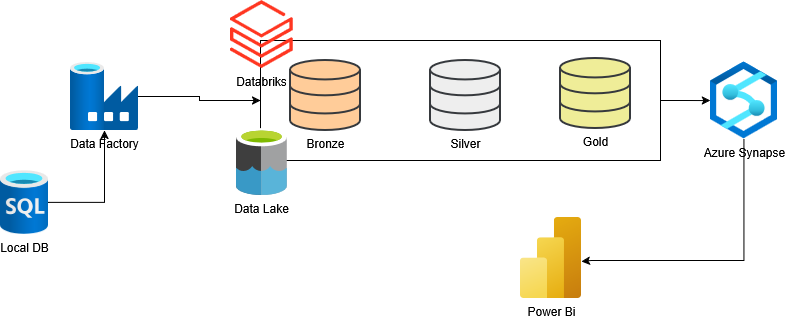

# Azure-Data-Engineering

An end-to-end data engineering project using Azure.

## Business Goal

Trust Marketplace wants to see whether the there is a significant difference in purchasing behaviours between male and female customers, in order to improve targeted advertising and marketing strategies.

## Project Overview

- Load the data from local SQL Server to Azure using Azure Data Factory.
- Use Azure Data Factory to orchestrate the data pipeline.
- Use Azure Databricks to perform data cleaning and transformation, separated into three stages:
    - Bronze: Raw data
    - Silver: Cleaned data (date standardisation)
    - Gold: Clean data (column names standardisation)
- Use Azure Synapse Analytics to get data schemas.
- Use Power BI to create a dashboard for data visualisation.

## Tools and Technologies
- Azure Data Factory
- Azure Data Lake
- Azure Databricks
- Azure Synapse Analytics
- Power BI
- SQL Server

